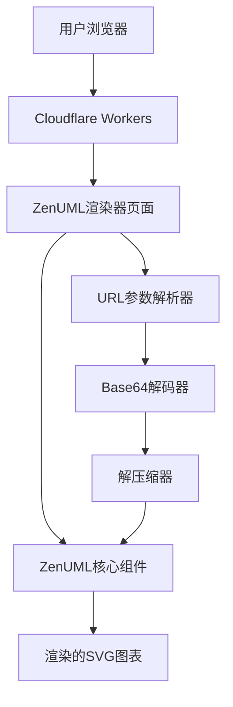

# 设计文档

## 概述

ZenUML Web渲染器是一个独立的网页应用，专门用于渲染ZenUML序列图。该应用将部署在Cloudflare Workers上，提供全球分布的快速访问。应用支持通过URL参数传递Base64编码和压缩的序列图代码，同时在没有代码时显示空的默认图表。

## 架构

### 整体架构



### 技术栈

- **前端框架**: React 19 + TypeScript
- **构建工具**: Vite
- **部署平台**: Cloudflare Workers
- **ZenUML核心**: 基于现有的@zenuml/core包
- **压缩库**: pako (gzip压缩/解压)
- **样式**: Tailwind CSS + 现有的ZenUML样式

## 组件和接口

### 1. 主应用组件 (WebRenderer)

```typescript
interface WebRendererProps {
  initialCode?: string;
  theme?: string;
}

interface WebRendererState {
  code: string;
  isLoading: boolean;
  error: string | null;
  theme: string;
}
```

**职责:**
- 管理应用的整体状态
- 协调URL参数解析和ZenUML渲染
- 处理错误状态和加载状态

### 2. URL参数处理器 (URLCodeHandler)

```typescript
interface URLCodeHandler {
  extractCodeFromURL(): string | null;
  generateURLWithCode(code: string): string;
  decodeAndDecompress(encodedCode: string): string;
  compressAndEncode(code: string): string;
}
```

**职责:**
- 从URL查询参数中提取编码的代码
- 解码Base64编码的内容
- 解压缩gzip压缩的内容
- 生成包含编码代码的URL

### 3. ZenUML渲染包装器 (ZenUMLWrapper)

```typescript
interface ZenUMLWrapperProps {
  code: string;
  theme: string;
  onError: (error: Error) => void;
  onRenderComplete: () => void;
}
```

**职责:**
- 封装ZenUML核心渲染逻辑
- 处理渲染错误
- 提供渲染完成回调

### 4. 错误边界组件 (ErrorBoundary)

```typescript
interface ErrorBoundaryState {
  hasError: boolean;
  error: Error | null;
}
```

**职责:**
- 捕获React组件树中的错误
- 显示友好的错误信息
- 提供重试机制

## 数据模型

### URL参数格式

```
https://renderer.zenuml.com/?code={base64_encoded_compressed_code}&theme={theme_name}
```

**参数说明:**
- `code`: Base64编码的gzip压缩ZenUML代码
- `theme`: 可选的主题名称 (default, dark, blue等)

### 代码处理流程

```
原始ZenUML代码 → gzip压缩 → Base64编码 → URL参数
URL参数 → Base64解码 → gzip解压 → ZenUML代码 → 渲染
```

### 默认代码

当没有提供代码参数时，使用以下默认代码：

```
// 空的序列图，显示基本结构
@startuml
title ZenUML Renderer
@enduml
```

## 错误处理

### 错误类型和处理策略

1. **URL参数错误**
   - Base64解码失败 → 显示错误信息，回退到默认代码
   - 解压缩失败 → 显示错误信息，回退到默认代码

2. **ZenUML渲染错误**
   - 语法错误 → 显示语法错误信息和行号
   - 渲染异常 → 显示通用错误信息，提供重试按钮

3. **网络错误**
   - 资源加载失败 → 显示网络错误信息
   - 超时 → 显示超时错误信息

### 错误信息国际化

支持中英文错误信息：

```typescript
interface ErrorMessages {
  en: {
    decodeError: "Failed to decode URL parameter";
    renderError: "Failed to render diagram";
    networkError: "Network error occurred";
  };
  zh: {
    decodeError: "URL参数解码失败";
    renderError: "图表渲染失败";
    networkError: "网络错误";
  };
}
```

## 测试策略

### 单元测试

1. **URL参数处理测试**
   - 正确的Base64编码/解码
   - 正确的压缩/解压缩
   - 错误输入的处理

2. **组件渲染测试**
   - 默认状态渲染
   - 有效代码渲染
   - 错误状态渲染

### 集成测试

1. **端到端流程测试**
   - 完整的URL参数到渲染流程
   - 错误恢复流程
   - 主题切换功能

2. **浏览器兼容性测试**
   - 现代浏览器支持
   - 移动设备响应式设计

### 性能测试

1. **渲染性能**
   - 大型图表渲染时间
   - 内存使用情况
   - 首次加载时间

2. **Cloudflare Workers性能**
   - 冷启动时间
   - 响应时间
   - 全球分布性能

## Cloudflare Workers集成

### Workers脚本结构

```typescript
export default {
  async fetch(request: Request): Promise<Response> {
    const url = new URL(request.url);
    
    // 处理静态资源
    if (url.pathname.startsWith('/assets/')) {
      return handleStaticAssets(request);
    }
    
    // 返回主HTML页面
    return new Response(htmlContent, {
      headers: {
        'Content-Type': 'text/html;charset=UTF-8',
        'Cache-Control': 'public, max-age=3600'
      }
    });
  }
};
```

### 静态资源处理

- CSS文件内联到HTML中减少请求数
- JavaScript打包为单个文件
- SVG图标内联或使用Data URLs
- 字体文件通过CDN加载

### 缓存策略

1. **HTML页面**: 1小时缓存
2. **静态资源**: 1天缓存，使用版本号
3. **API响应**: 不缓存

### 环境变量配置

```toml
# wrangler.toml
[env.production]
vars = { 
  ENVIRONMENT = "production",
  VERSION = "1.0.0"
}

[env.staging]
vars = { 
  ENVIRONMENT = "staging",
  VERSION = "1.0.0-beta"
}
```

## 安全考虑

### 输入验证

1. **URL参数验证**
   - 限制参数长度
   - 验证Base64格式
   - 限制解压后代码长度

2. **XSS防护**
   - 使用DOMPurify清理用户输入
   - CSP头部设置
   - 输出编码

### 内容安全策略

```
Content-Security-Policy: 
  default-src 'self'; 
  script-src 'self' 'unsafe-inline'; 
  style-src 'self' 'unsafe-inline'; 
  img-src 'self' data:;
```

## 性能优化

### 前端优化

1. **代码分割**: 按需加载ZenUML组件
2. **懒加载**: 大型图表延迟渲染
3. **缓存**: 渲染结果本地缓存
4. **压缩**: Gzip压缩所有文本资源

### Workers优化

1. **边缘缓存**: 利用Cloudflare的全球CDN
2. **预渲染**: 常用图表预渲染缓存
3. **资源内联**: 减少HTTP请求数量

## 部署流程

### 构建流程

```bash
# 1. 安装依赖
pnpm install

# 2. 构建生产版本
pnpm run build:renderer

# 3. 部署到Cloudflare Workers
wrangler deploy
```

### CI/CD集成

```yaml
# GitHub Actions
name: Deploy to Cloudflare Workers
on:
  push:
    branches: [main]
jobs:
  deploy:
    runs-on: ubuntu-latest
    steps:
      - uses: actions/checkout@v3
      - uses: pnpm/action-setup@v2
        with:
          version: latest
      - name: Build and Deploy
        run: |
          pnpm install
          pnpm run build:renderer
          wrangler deploy
```

### 监控和日志

1. **Cloudflare Analytics**: 访问统计和性能监控
2. **错误追踪**: Sentry集成
3. **日志记录**: Workers日志和错误报告