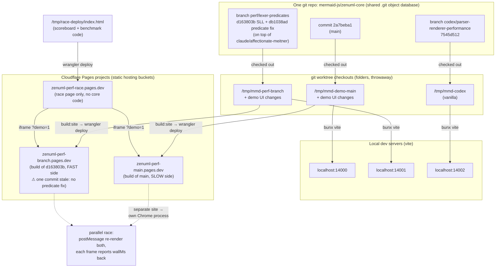

# Perf demo: one repo, three versions, three hosts

How a single git repository serves three versions of @zenuml/core simultaneously: `git worktree` gives each commit its own folder (all sharing one `.git` database), each folder runs its own dev server locally and is built+uploaded to its own Cloudflare Pages project, and the race page embeds two of those deployments as iframes on different sites so Chrome runs them in parallel processes.

Key points the picture encodes:

1. **There is no fork.** All three versions are commits in the *same* repository; `git worktree` lets multiple commits be checked out at once, each in its own folder, sharing one object database. Delete a folder and the commits survive.
2. **The codex version exists only locally** (worktree + port 14002). It was benchmarked but never deployed — the hosted race compares main vs the claude branch only.
3. **Cloudflare projects are dumb buckets.** Each receives a built `dist/` upload; they have no link back to git. Three exist because `*.pages.dev` subdomains are separate *sites*, which is what forces Chrome to give the two iframes separate renderer processes — the thing that makes the race genuinely parallel.
4. **The race page is the only piece not in the repo** — it lives in `/tmp/race-deploy/` (hosted variant) and `public/compare-perf.html` (local variant, in the demo worktrees), currently uncommitted.
