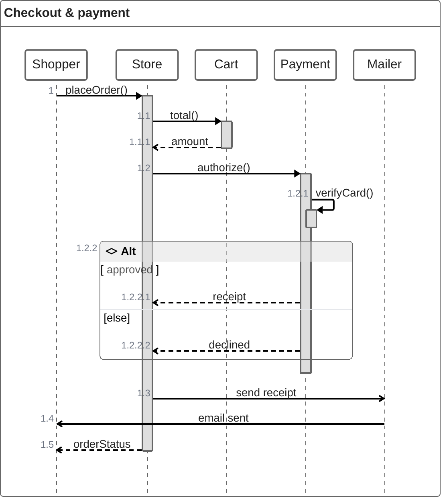
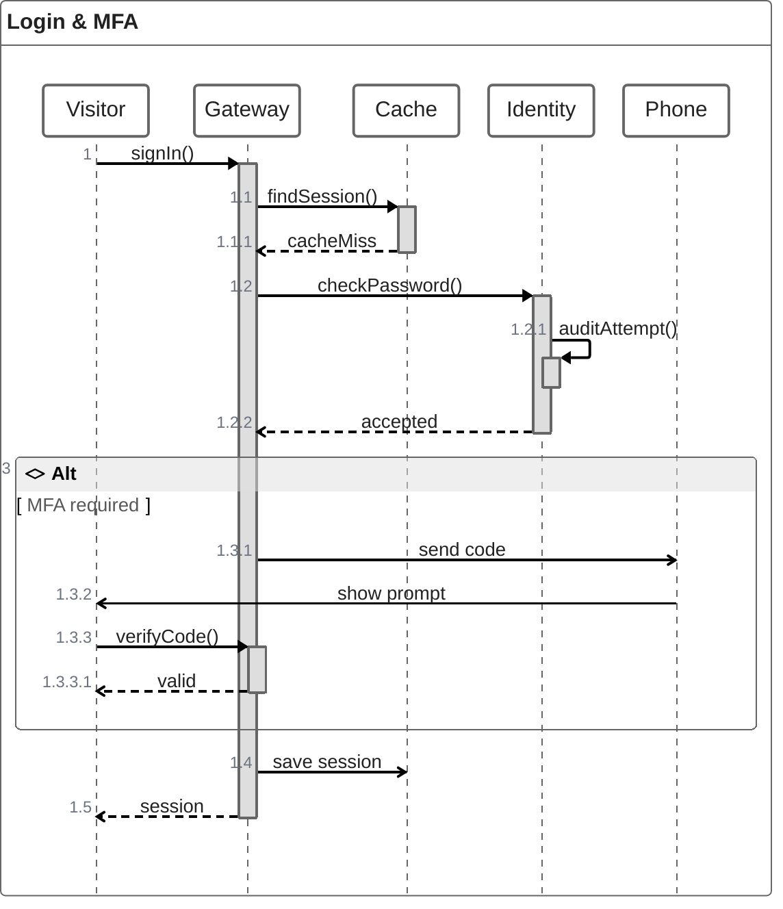
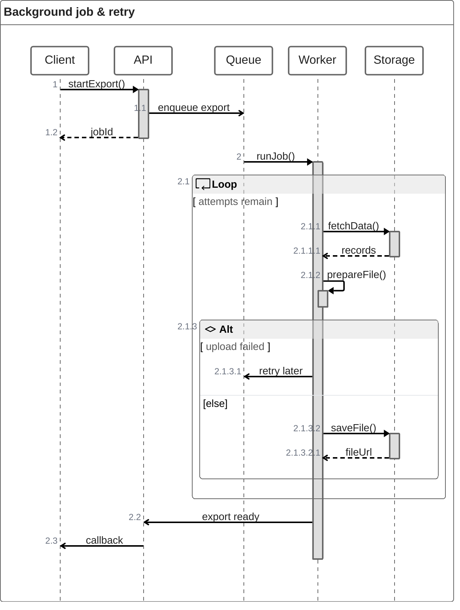

# Line weight review examples

These three examples appear in the [local review gallery](../e2e/tools/stroke-examples.html).

## Checkout & payment

```mermaid
zenuml
title Checkout & payment
Shopper -> Store.placeOrder() {
  Store -> Cart.total() {
    return amount
  }
  Store -> Payment.authorize() {
    Payment.verifyCard()
    if (approved) {
      return receipt
    } else {
      return declined
    }
  }
  Store -> Mailer: send receipt
  Mailer -> Shopper: email sent
  return orderStatus
}
```

## Login & MFA

```mermaid
zenuml
title Login & MFA
Visitor -> Gateway.signIn() {
  Gateway -> Cache.findSession() {
    return cacheMiss
  }
  Gateway -> Identity.checkPassword() {
    Identity.auditAttempt()
    return accepted
  }
  if (MFA required) {
    Gateway -> Phone: send code
    Phone -> Visitor: show prompt
    Visitor -> Gateway.verifyCode() {
      return valid
    }
  }
  Gateway -> Cache: save session
  return session
}
```

## Background job & retry

```mermaid
zenuml
title Background job & retry
Client -> API.startExport() {
  API -> Queue: enqueue export
  return jobId
}
Queue -> Worker.runJob() {
  loop (attempts remain) {
    Worker -> Storage.fetchData() {
      return records
    }
    Worker.prepareFile()
    if (upload failed) {
      Worker -> Queue: retry later
    } else {
      Worker -> Storage.saveFile() {
        return fileUrl
      }
    }
  }
  Worker -> API: export ready
  API -> Client: callback
}
```
