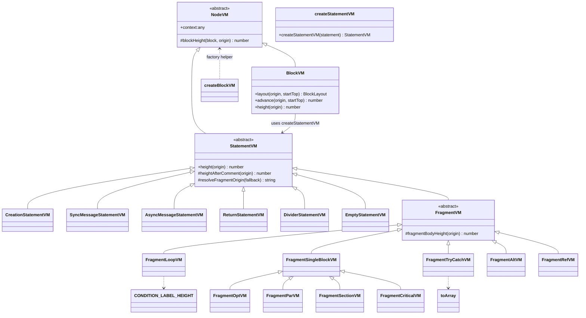

# VM Layer Overview

The classes in this directory provide the polymorphic layout engine for sequence-diagram blocks. `BlockVM` walks the parsed statements, dispatching to specialised `StatementVM` subclasses that report the vertical height each construct consumes. Helpers such as comment measurements and fragment metrics live alongside the VMs to keep the rendering components lean.

